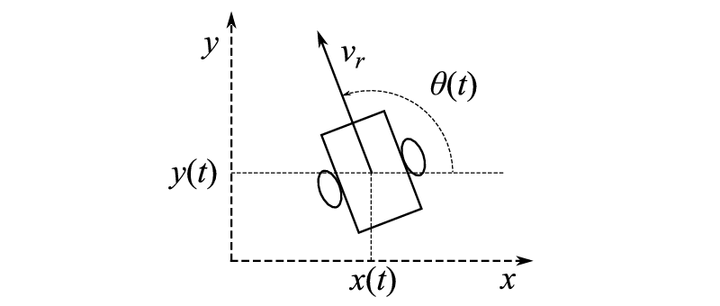

# Unicycle

<p align="center">
  
</p>


## System dynamics

### Continuous time forward kinematics

Let as define the state in $SE(2)$, where $x$ and $y$ define 2D coordinates and $\theta$ represents the yaw orientation with respect to the origin frame.
The input is defined by the linear velocity $v$ and the yaw rate $\omega$.

$$
\begin{aligned}
\text{State}:& \quad \mathbb{X} &= (x, y, \theta) \\
\text{Input}:& \quad \mathbb{U} &= (v, \omega) \\
\end{aligned}
$$

The nonlinear differential equations describing the **system dynamics** are

$$
\begin{aligned}
\dot{x} &= \quad v \cdot \cos{\theta} \\
\dot{y} &= \quad v \cdot \sin{\theta} \\
\dot{\theta} &= \quad \omega
\end{aligned}
$$

On a (slightly) lower level, we can express the input as the wheels rotational speeds $\hat{\mathbb{U}} = (\omega_{R}, \omega_{L})$, where $U$ and $\hat{U}$ and related by

$$
\begin{aligned}
v &= \frac{r}{2} \cdot (\omega_{R} + \omega_{L}) \\
\omega &= \frac{r}{l} \cdot (\omega_{R} - \omega_{L})
\end{aligned}
$$

In view of that, the **system dynamics** can be rewritten as

$$
\begin{aligned}
\dot{x} &= \quad \frac{r}{2} \cdot (\omega_{R} + \omega_{L}) \cdot \cos{\theta}\\
\dot{y} &= \quad \frac{r}{2} \cdot (\omega_{R} + \omega_{L}) \cdot \sin{\theta}\\
\dot{\theta} &= \quad \frac{r}{l} \cdot (\omega_{R} - \omega_{L})
\end{aligned}
$$

### Discrete time forward kinematics
From the continuous time kinematics, the discrete implementation comes naturally as

$$
\begin{aligned}
x_{t+1} &= \quad x_{t} + \Delta_{t} \cdot [\frac{r}{2} \cdot (\omega_{R_{t}} + \omega_{L_{t}}) \cdot \cos{\theta_{t}}] \\
y_{t+1} &= \quad y_{t} + \Delta_{t} \cdot [\frac{r}{2} \cdot (\omega_{R_{t}} + \omega_{L_{t}}) \cdot \sin{\theta_{t}}] \\
\theta_{t+1} &= \quad \theta_{t} + \Delta_{t} \cdot [\frac{r}{l} \cdot (\omega_{R_{t}} - \omega_{L_{t}})]
\end{aligned}
$$

### Dicrete time inverse kinematics

As a consequence of the non-[holonomicity](https://en.wikipedia.org/wiki/Holonomic_constraints) of the system, a singularity arises in the implementation of the inverse kinematics. To handle it, two different implementations need to be used based on yaw orientation. In particular,

if $|\cos{\theta_{avg}} >= 0.5|$ :

$$
\begin{aligned}
\omega_{R_{t}} &= \quad \frac{1}{4} \cdot \frac{x_{t+1} - x_{t}}{\Delta_{t} \cdot r \cdot \cos{\theta_{avg}}} + \frac{1}{2} \cdot \frac{\theta_{t+1} - \theta_{t}}{\Delta_{t} \cdot (r/l)} \\
\omega_{L_{t}} &= \quad \frac{1}{4} \cdot \frac{x_{t+1} - x_{t}}{\Delta_{t} \cdot r \cdot \cos{\theta_{avg}}} - \frac{1}{2} \cdot \frac{\theta_{t+1} - \theta_{t}}{\Delta_{t} \cdot (r/l)}
\end{aligned}
$$

else:

$$
\begin{aligned}
\omega_{R_{t}} &= \quad \frac{1}{4} \cdot \frac{y_{t+1} - y_{t}}{\Delta_{t} \cdot r \cdot \sin{\theta_{avg}}} + \frac{1}{2} \cdot \frac{\theta_{t+1} - \theta_{t}}{\Delta_{t} \cdot (r/l)} \\
\omega_{L_{t}} &= \quad \frac{1}{4} \cdot \frac{y_{t+1} - y_{t}}{\Delta_{t} \cdot r \cdot \sin{\theta_{avg}}} - \frac{1}{2} \cdot \frac{\theta_{t+1} - \theta_{t}}{\Delta_{t} \cdot (r/l)}
\end{aligned}
$$

## Build
```
git clone https://github.com/giusenso/unicycle.git
cd unicycle
mkdir build && cd build
cmake ..
cmake --build .
```
